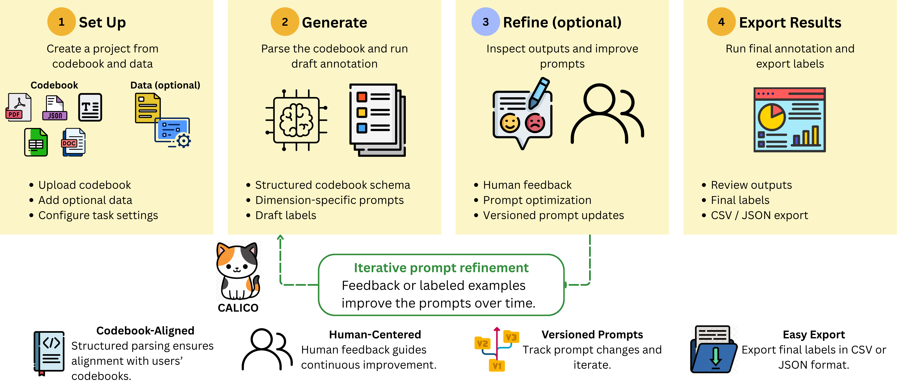

# CALICO

**C**odebook-**A**ligned **L**LM-assisted **I**terative **C**oding and **O**ptimization: a human-centered workflow for codebook-aligned LLM annotation.

- **Website:** https://calico-annotation.github.io/
- **Live demo:** linked from the website (no installation needed)
- **License:** Apache 2.0 (see [LICENSE](./LICENSE))
- **Paper:** EMNLP 2026 System Demonstrations (under review)

## Workflow


## Quick Start (Docker, recommended)

```bash
cd annotagent
cp .env.example .env   # add OPENAI_API_KEY / ANTHROPIC_API_KEY, or paste keys per-project in the UI
docker compose up --build
# Frontend: http://localhost:8080   Backend API: http://localhost:8000
```

## Quick Start (local dev, two terminals)

Terminal 1 — backend:

```bash
cd annotagent/backend
pip install -r requirements.txt
uvicorn app.main:app --reload --port 8000
```

Terminal 2 — frontend:

```bash
cd annotagent/frontend
npm install
npm run dev
```

## Smoke test (under a minute)

Sample codebooks and datasets live in [`annotagent/seed/`](./annotagent/seed):

- `annotagent/seed/self_disclosure_demo.json` — 10-item multi-dimensional self-disclosure sample
- `annotagent/seed/sentiment_demo.json` — 10-item sentiment sample

Create a project, upload one of these in Project Setup, generate prompts, and run annotation end-to-end. An LLM API key (OpenAI or Anthropic) is required for annotation and optimization; everything else (codebook parsing preview, prompt inspection, versioning) works without one.

## What CALICO supports

- **Codebook ingestion:** PDF, DOCX, XLSX, CSV, JSON, and plain text, parsed into a canonical schema the user reviews and edits before use.
- **Prompt generation:** one editable, versioned prompt per coding dimension, derived from the accepted schema.
- **Annotation:** single-label discrete dimensions (the released annotation and optimization workflow targets one label per dimension per item; hierarchical/gated dimensions are supported via the codebook schema).
- **Human feedback:** natural language feedback on inspected outputs is summarized into calibration guidance; proposed prompt revisions are shown as diffs and applied only on approval, as a new prompt version.
- **Label-supervised prompt optimization:** GEPA, MIPROv2, OPRO, and ReflectAgent behind one interface, with deterministic stratified train/val/test splits, a leakage guard and audit, and one-shot held-out test scoring.
- **Export:** final labels as CSV or JSON.

Not yet supported in the released workflow: multi-label set prediction (a research prototype lives in `annotagent/backend/scripts/multilabel_diag.py`), soft label distributions, and fine-tuning of annotation models.

## Architecture

- **Backend:** FastAPI + SQLAlchemy + SQLite (async) — `annotagent/backend/`
- **Frontend:** React + TypeScript + Tailwind CSS + Recharts — `annotagent/frontend/`
- **LLM support:** OpenAI and Anthropic APIs
- **Optimizers:** `annotagent/backend/app/optimizers/` (ReflectAgent, GEPA, MIPROv2, OPRO)

## API Endpoints

| Method | Endpoint | Description |
|--------|----------|-------------|
| GET | `/api/projects` | List projects |
| POST | `/api/projects` | Create project |
| POST | `/api/projects/:id/codebooks` | Upload codebook |
| POST | `/api/projects/:id/datasets` | Upload dataset |
| POST | `/api/projects/:id/pipelines/decompose` | Generate pipeline |
| POST | `/api/projects/:id/jobs` | Start annotation job |
| GET | `/api/projects/:id/jobs/:jid/results` | Get results |
| GET | `/api/projects/:id/jobs/:jid/results/metrics` | Get metrics |
| GET | `/api/projects/:id/jobs/:jid/results/export` | Export CSV/JSON |
| WS | `/ws/jobs/:jid` | Real-time progress |

## Codebook Format

```json
{
  "name": "My Codebook",
  "description": "Description",
  "dimensions": [
    {
      "name": "Sentiment",
      "type": "single_label",
      "labels": [
        {"name": "Positive", "definition": "...", "examples": []},
        {"name": "Negative", "definition": "...", "examples": []}
      ],
      "instructions": "Additional guidance..."
    }
  ],
  "decomposition_hints": {
    "groups": [["Dim1"], ["Dim2", "Dim3"]],
    "order": ["Step1", "Step2"]
  }
}
```

## Reproducing the paper's experiments

Experiment scripts live in `annotagent/backend/scripts/` (e.g. `run_multiseed.py`, `run_specificity.py`, `run_k3_sweep.py`); raw result files with per-seed artifacts are in `exp_result/`. Splits are deterministic (SHA-256-seeded, stratified); the held-out test split is scored exactly once per run.
